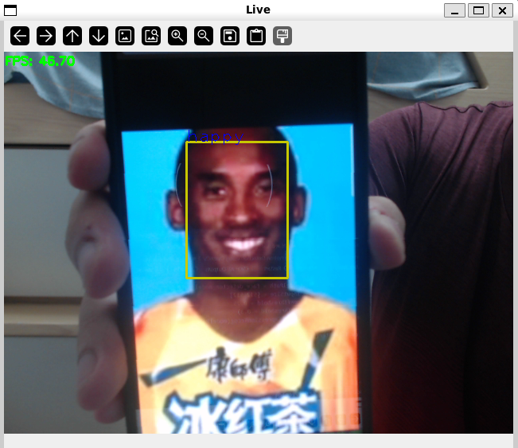

# Emotion Detection Using OpenCV

Demo:


## What is this

We used openCV to perform facial emotion detection. 

For more details please check [Emotion_detection.ipynb](Emotion_detection.ipynb).

Relevant code below:

```python
# Initializing models
face_detector = YuNet(modelPath = face_detector_model_path,
                      inputSize = [512,512],
                      confThreshold = 0.75,
                      nmsThreshold = 0.3)
expression_detector = FacialExpressionRecog(modelPath=experssion_detector_model_path)

tm = cv.TickMeter()

# Main Inference Loop
deviceId = 0
cap = cv.VideoCapture(deviceId)
frameWidth = int(cap.get(cv.CAP_PROP_FRAME_WIDTH) * scaling_ratio)
frameHeight = int(cap.get(cv.CAP_PROP_FRAME_HEIGHT) * scaling_ratio)
face_detector.setInputSize([frameWidth, frameHeight])

while True:
    # Break if cannot capture image
    hasFrame, frame = cap.read()
    if not hasFrame:
        print('No input detected ...')
        break
    
    pressedKey = cv.waitKey(1) & 0xFF
    if pressedKey == ord("q"):
        break

    frame = cv.resize(frame, (frameWidth, frameHeight))

    # Inference
    tm.start()
    faces = face_detector.infer(frame) # faces is a tuple
    emotions = process_faces(frame, faces, expression_detector, verbose)
    tm.stop()

    # Draw results on the input image
    visualize(frame, faces, emotions, tm.getFPS(), verbose = verbose)

    # Visualize results
    cv.imshow('Live', frame)
    
cap.release()
cv.destroyAllWindows()
```
